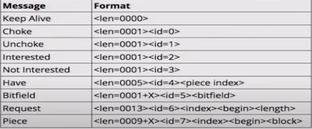

# BitTorrent
BitTorrent Implementation

## Bencoding / Bdecoding

Bencode is encoding used by BitTorrent to storing and transmitting data.

It supports 4 different types of values:
- integers
- byte strings
- lists
- dictionaries

*Example:*

5:abcde3:123i12345eli987eli654eei321ee
i999999999ed3:onei11e3:twoi22ee4:bye!

bdecoder is supposed to translate this bencode data like this:
- 5 means its a byte string length of 5: abcde => (string) abcde \n
- 3 means its a byte string length of 3: 123  => (string) 123
- 'i' means its an integer till we get to 'e': 12345 => (int) 12345
- 'l' means its a list  => (int) 987, (int) 654 
- ...
- 'd' means its a dictionary => (string) one : (int) 11, (string) two : (int) 22

## Peer Class

Working with Peers:
* Manage Peer State
  * Chocked
  * Interested
* Peer Messages
  * Handshake
  * Keep Alive
  * Choke
  * Unchoke
  * Interested
  * Not Interested
  * Have
  * Bitfield
  * Request
  * Piece
  
Inital state: Chocked, Not Interested.

Cooperative state: Unchoked, Interested.

### Handshake

### Peer Message Exchange

### Peer Message Formats

The length prefix is a 4-byte big-endian value.

Message ID is a single decimal character.

The combination of these two fields identifies each kind of message :
* Keep Alive <len=0000> : length 0, no ID, no payload (to avoid closing a connection after a certain period of inactivity)

* Choke <len=0001><id=0> : chocked the client that recieves this message

* Unchoke <len=0001><id=1> : unchoked the client that recieves this essage

* Interested <len=0001><id=2> : inform a client that a peer is interested in at least one of the pieces it owns

* Not Interested <len=0001><id=3> : inform a client that a peer is not interested

* Have <len=0005><id=4><piece index> : A pice of the file has just been succesfully downloaded and verified.
 
* Bitfield <len=000+X><id=5><bitfield> : It informs which parts of the file the client has. Cleared bits correspond to a misssing piece, set bits to a valid and available piece.
 
* Request <len=00013><id=6><index><begin><length> : used to request a block of data in a piece
 * Index: integer specifying the zero-based piece index
 * Begin: integer specifying the zero-based byte offset within the piece
 * Length: integer specifying the request length 
 
* Piece <len=0009+X><id=7><index><begin><block> : message that cointains a block of data, where X is the length of the block of data
 * Index: integer specifying the zero-based piece index
 * Begin: integer specifying the zero-based byte offset within the piece
 * Block: block  of data, which is a subset of the piece specified by index

* Cancel <len=00013><index><begin><length> : cancels a block request
 
 *Taken from: http://pages.di.unipi.it/ricci/jBittorrentAPI_report.pdf*
