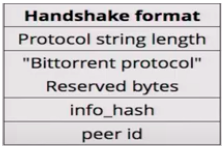

# BitTorrent
BitTorrent Implementation

## Bencoding / Bdecoding

Bencode is encoding used by BitTorrent to storing and transmitting data.

It supports 4 different types of values:
- integers
- byte strings
- lists
- dictionaries

*Example:*

5:abcde3:123i12345eli987eli654eei321ee
i999999999ed3:onei11e3:twoi22ee4:bye!

bdecoder is supposed to translate this bencode data like this:
- 5 means its a byte string length of 5: abcde => (string) abcde \n
- 3 means its a byte string length of 3: 123  => (string) 123
- 'i' means its an integer till we get to 'e': 12345 => (int) 12345
- 'l' means its a list  => (int) 987, (int) 654 
- ...
- 'd' means its a dictionary => (string) one : (int) 11, (string) two : (int) 22

## Peer Class

Working with Peers:
* Manage Peer State
  * Chocked
  * Interested
* Peer Messages
  * Handshake
  * Keep Alive
  * Choke
  * Unchoke
  * Interested
  * Not Interested
  * Have
  * Bitfield
  * Request
  * Piece
  
Inital state: Chocked, Not Interested.

Cooperative state: Unchoked, Interested.

### Handshake

### Peer Message Exchange

### Peer Message Formats

