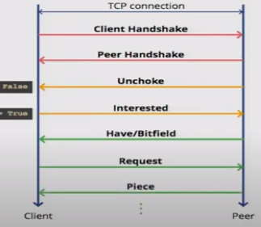

# BitTorrent
BitTorrent Implementation

## Bencoding / Bdecoding

Bencode is encoding used by BitTorrent to storing and transmitting data.

It supports 4 different types of values:
- integers: i/<integer in ASCCI>e
- byte strings: /<string length in ASCCI>:/<string data>
- lists: l/<bencoded value>..../<bencoded value>e
- dictionaries d/<bencoded string>/<bencoded element>e

*Example:*

5:abcde3:123i12345eli987eli654eei321ee
i999999999ed3:onei11e3:twoi22ee4:bye!

bdecoder is supposed to translate this bencode data like this:
- 5 means its a byte string length of 5: abcde => (string) abcde \n
- 3 means its a byte string length of 3: 123  => (string) 123
- 'i' means its an integer till we get to 'e': 12345 => (int) 12345
- 'l' means its a list  => (int) 987, (int) 654 
- ...
- 'd' means its a dictionary => (string) one : (int) 11, (string) two : (int) 22

## Tracker Protocol
Tracker allows peers to find other peers sharing the same content.
It returns a random list of peers that have that content.
When a peer wants to share or download, it contacts the tracker using HTTP GET request (Tracker HTTP Protocol).

Tracker communication:
* infoHash: 20 byte hash of value of the info ket from the metafile.
* peerId: 20 byte string used as a unique ID for the client
* port: port number that the client is listening on
* uploaded: total amount uploaded
* downloaded: total amount downloaded
* left: number of bites the client still has to download

## Peer Wire Protocol
Message exchange between peers is done using the Peer Wire Protocol.

Working with Peers:
* Manage Peer State
  * Chocked
  * Interested
* Peer Messages
  * Handshake - initial message between peers
  * Keep Alive - keep the connection alve
  * Choke - informing the remote peer that it is choked
  * Unchoke - informing the remote peer that it is unchoked
  * Interested - informing the remote peer that we are interested
  * Not Interested - informing the remote peer that we are not interested
  * Have - informing remote peers that we have the new piece
  * Bitfield -  message indicating which pieces a peer has, so other peers can decide whether they are interested or not.
  * Request - request a piece of the ocntent from a remote peer
  * Piece - sends a piece of content to a remote peer
  * Cancel - cancela  piece request
  
Inital state: Chocked, Not Interested.

Cooperative state: Unchoked, Interested.

### Handshake
The communication between peers starts with a handshake.
Handshake massage form: \<pstrlen>\<pstr>\<reserved>\<info_hash>\<peer_id> 
 * pstrlen: string length of <pstr> as a single raw byte - 19 bytes
 * pstr: string idetifier of the protocol : "Bittorent protocol"
 * reserved: 8 reserved bytes
 * infoHash: 20 byte hash of the info key -- sent in tracker request
 * peerId: 20 byte string -- unique ID for the client sending the message
 

### Peer Message Exchange

### Peer Message Formats

The length prefix is a 4-byte big-endian value.

Message ID is a single decimal character.

The combination of these two fields identifies each kind of message :
* Keep Alive  <len=0000> : length 0, no ID, no payload (to avoid closing a connection after a certain period of inactivity)

* Choke <len=0001><id=0> : chocked the client that recieves this message

* Unchoke <len=0001><id=1> : unchoked the client that recieves this essage

* Interested <len=0001><id=2> : inform a client that a peer is interested in at least one of the pieces it owns

* Not Interested <len=0001><id=3> : inform a client that a peer is not interested

* Have <len=0005><id=4>\<piece index> : A pice of the file has just been succesfully downloaded and verified.
 
* Bitfield <len=000+X><id=5>\<bitfield> : It informs which parts of the file the client has. Cleared bits correspond to a misssing piece, set bits to a valid and available piece.
 
* Request <len=00013><id=6>\<index>\<begin>\<length> : used to request a block of data in a piece
 * Index: integer specifying the zero-based piece index
 * Begin: integer specifying the zero-based byte offset within the piece
 * Length: integer specifying the request length 
 
* Piece <len=0009+X><id=7>\<index>\<begin>\<block> : message that cointains a block of data, where X is the length of the block of data
 * Index: integer specifying the zero-based piece index
 * Begin: integer specifying the zero-based byte offset within the piece
 * Block: block  of data, which is a subset of the piece specified by index

* Cancel <len=00013>\<id=8>\<index>\<begin>\<length> : cancels a block request

So every message starts with a 4-byte length prefix followed by a single byte message id, followed by a payload that differs depending on a message.

 
 *Taken from: http://pages.di.unipi.it/ricci/jBittorrentAPI_report.pdf,
              http://www.kristenwidman.com/blog/33/how-to-write-a-bittorrent-client-part-1/*
